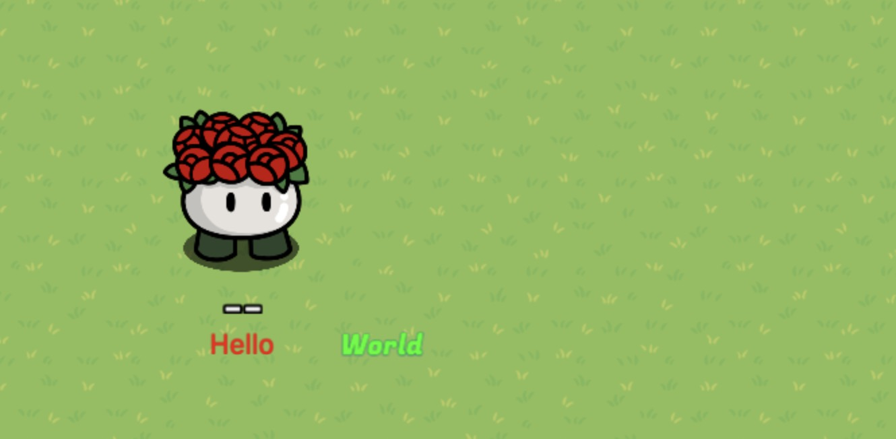

# gimbuild

gimbuild provides:

- a standardized way to programmatically create Gimkit devices
- a convenient, strongly-typed API to create builds following that standard

## Why

Right now, the best way to automatically place devices is with a bunch of `stores.network.room.send` calls. gimbuild makes the process better with:

- less repeated code across different gimkit device generation projects
- a much more convenient API
  - strongly typed device options with defaults makes device creation much more intuitive
- easier sharing of builds, and less security worries from pasting code into the console because it's now just JSON
- separation of concerns between build generation and build placement
  - if your build generation script was big, you now won't have to paste the entire thing into the console to update the build
- ability place the same build by abstracting device away device ids

## Installation

```bash
npm install github:Ashwagandhae/gimbuild
```

## Example

This code creates a build with two text devices, one saying "Hello" and the other saying "World":

```ts
import { build, device } from 'gimbuild';

// create an "absolute" positioned build. use "relative" for builds that can be moved around (e.g. to the player's position).
let b = build('absolute')
  .addDevice(
    device('textBillboard')
      // device options start as gimkit defaults.
      .options({
        text: 'Hello',
        fontSize: 20,
        color: '#FF0000',
      })
      // you can set x, y and depth. relative builds are centered at (0, 0).
      .transform({
        x: 16000,
        y: 16000,
      })
  )
  .addDevice(
    device('textBillboard')
      .options({
        text: 'World',
        fontSize: 20,
        color: '#00FF00',
        strokeColor: '#0000FF',
        strokeThickness: 1,
      })
      // setOption can be used to set a single option.
      .setOption('googleFont', 'Fugaz One')
      .transform({
        x: 16100,
        y: 16000,
      })
  )
  .build();

console.log(JSON.stringify(b));
```

Outputs the following JSON:

```
{"positionType":"absolute","devices":[{"type":"textBillboard","transform":{"x":16000,"y":16000},"options":{"text":"Hello","fontSize":20,"scope":"global","googleFont":"Rubik","color":"#FF0000","alpha":1,"strokeThickness":0,"strokeColor":"#FFFFFF","rotation":0,"visibleOnGameStart":"Yes","showWhenReceivingFrom":"","hideWhenReceivingFrom":""},"codeGrids":[]},{"type":"textBillboard","transform":{"x":16100,"y":16000},"options":{"text":"World","fontSize":20,"scope":"global","googleFont":"Fugaz One","color":"#00FF00","alpha":1,"strokeThickness":1,"strokeColor":"#0000FF","rotation":0,"visibleOnGameStart":"Yes","showWhenReceivingFrom":"","hideWhenReceivingFrom":""},"codeGrids":[]}]}
```

You can install a plugin [ClipboardGimbuilder](https://github.com/Ashwagandhae/gimbuild/tree/main/plugins/clipboard-gimbuilder), copy the JSON, and type `shift` + `v` to create the build in creative:


